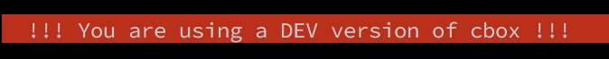

# cbox

**cbox** helps you organizing and finding those useful commands you find time to time and would really love to store for future occassions.

## Installation

### Option 1: Install a pre-compiled release

Go to https://github.com/dplabs/cbox/releases and download latest precompiled release.

### Option 2: Install from source

If you want a production build from sources, just use:

    make build-prod

or

    make install-prod

Default compilation of the sources uses a *dev* cloud environment. In order to get a binary pointing to the real cloud, you need to setup some variables, previous two commands take care of that for you.

But you still can install a development version of `cbox`, by simply executing:

    go get github.com/dplabs/cbox
    go install github.com/dplabs/cbox

and you'll be ready to go! IMPORTANT! That version will work exactly the same way that our releases do, but will be using a development cloud environment, meaning that you won't get the same results as in the real one. Also, whatever data you push there will be potentially be deleted periodically.

### Cloud Setup

#### Cloud Dev

There is a cloud environment that can be used for development purposes. In order to point your cbox installation to the dev cloud, you have to set `cbox.environment` setting to `dev`

    cbox config set cbox.environment dev

If you are executing from the sources without performing a release of cbox cli, then by default `cbox.environment` is set to `dev`. If you'd like to point to the prod cloud, the you have to modify `settings.go` (/internal/app/core/settings.go) and set the vars:

- `Env` to `prod`
- `Version` to an accepted version from the server, like `0.0.1`, `1.2.3`, etc.

Important: don't commit these changes, development code must always point to the dev cloud.
 
## Tutorial

## Documentation

- [Spaces](./wiki/Spaces)
- [Selectors](./wiki/Selectors)
- [Settings](./wiki/Settings)

## About

Daniel Pecos Martinez - https://danielpecos.com
